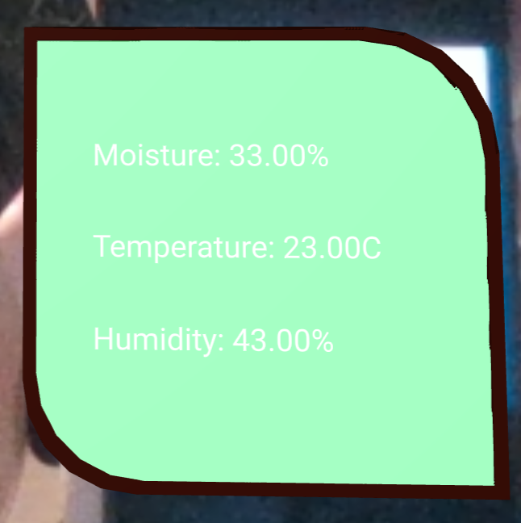
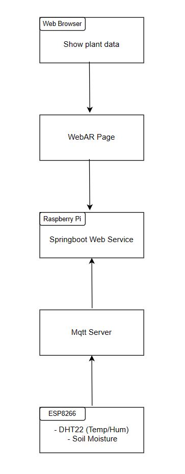

# CASA0014-Plant-Monitor

### Project Overview

Plant Monitor is an intelligent system designed to monitor plant environments, providing real-time insights into temperature, humidity, and soil moisture levels. The system integrates multiple key components, including the DHT22 temperature and humidity sensor, soil moisture sensor, and ESP8266 for Wi-Fi connectivity. It utilizes the MQTT protocol to upload data to an MQTT server. Additionally, the system includes a Raspberry Pi acting as a gateway, running a Spring Boot-based web service that supports WebAR. This allows users to view their plant's status in real-time via mobile devices.

#### Key Features:

- Real-time monitoring of environmental temperature, humidity, and soil moisture for plants.
- Data uploading to an MQTT server through ESP8266's Wi-Fi connection.
- Raspberry Pi acts as a gateway, providing WebAR support for users to view plant status via mobile devices.
- Data publication and subscription using MQTT for real-time and reliable data transmission.

### Concept Sketches

    

		
    

    

        1. ESP8266 Sensors:
		 
        <ul>
            <li>Using DHT22 temperature and humidity sensor and soil moisture sensor made of two nails for data monitoring.</li>
            <li>The DHT22 uses digital inputs and the soil moisture sensor uses analog inputs.</li>
            <li>The collected data is published to mqtt server every 15 seconds via wifi.</li>
        </ul>
         
        2. Mqtt Server
       	 
        <ul>
            <li>Receive data and will forward it to the Raspberry Pi</li>
        </ul>
         
        3. Rasbarry Pi
         
        <ul>
            <li></li>
        </ul>

